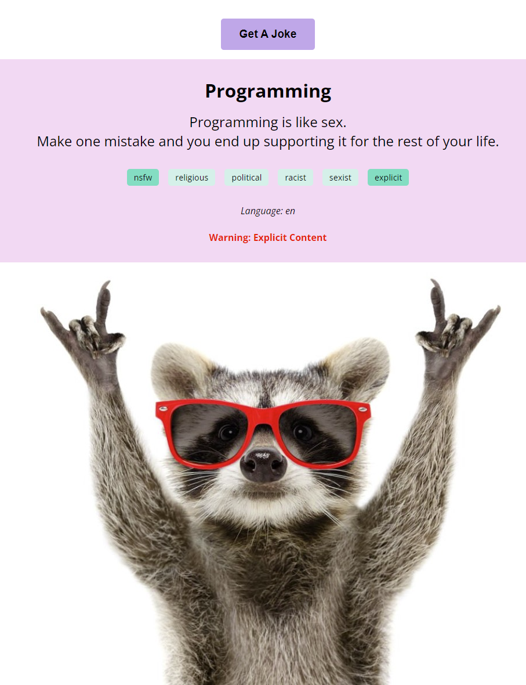

# Jokes API

> A simple website that allows user to get jokes.

## Table of contents

- [Jokes API](#jokes-api)
  - [Table of contents](#table-of-contents)
  - [General info](#general-info)
  - [Screenshots](#screenshots)
  - [Technologies](#technologies)
  - [Setup](#setup)
  - [Code Examples](#code-examples)
  - [Status](#status)

## General info

> The objective of the project is to practice using get requests and apply
> separation of concerns.

## Screenshots



## Technologies

- JavaScript
- HTML5
- CSS3
- VS Code

## Setup

Clone the repo and run npm install.

## Code Examples

```js
const getJoke = async () => {
	try {
		const response = await fetch('https://v2.jokeapi.dev/joke/Any');
		if (response.ok) {
			const data = await response.json();
			return data;
		} else {
			throw new Error('Failed to fetch joke');
		}
	} catch (err) {
		console.error(err);
	}
};

export default getJoke;
```

## Status

Project is: _done_
